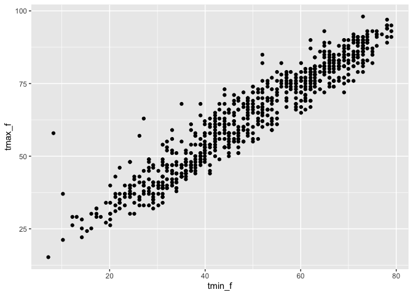
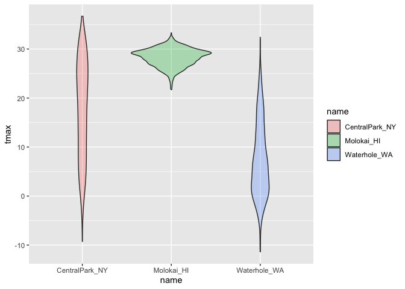
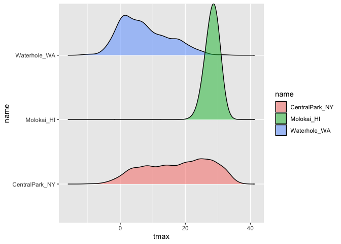

Visualization
================

``` r
library(tidyverse)
```

    ## ── Attaching core tidyverse packages ──────────────────────── tidyverse 2.0.0 ──
    ## ✔ dplyr     1.2.1     ✔ readr     2.2.0
    ## ✔ forcats   1.0.1     ✔ stringr   1.6.0
    ## ✔ ggplot2   4.0.3     ✔ tibble    3.3.1
    ## ✔ lubridate 1.9.5     ✔ tidyr     1.3.2
    ## ✔ purrr     1.2.2     
    ## ── Conflicts ────────────────────────────────────────── tidyverse_conflicts() ──
    ## ✖ dplyr::filter() masks stats::filter()
    ## ✖ dplyr::lag()    masks stats::lag()
    ## ℹ Use the conflicted package (<http://conflicted.r-lib.org/>) to force all conflicts to become errors

``` r
library(ggridges)

library(p8105.datasets)
data("weather_df")
```

Now we have everything we need!

``` r
weather_df
```

    ## # A tibble: 2,190 × 6
    ##    name           id          date        prcp  tmax  tmin
    ##    <chr>          <chr>       <date>     <dbl> <dbl> <dbl>
    ##  1 CentralPark_NY USW00094728 2021-01-01   157   4.4   0.6
    ##  2 CentralPark_NY USW00094728 2021-01-02    13  10.6   2.2
    ##  3 CentralPark_NY USW00094728 2021-01-03    56   3.3   1.1
    ##  4 CentralPark_NY USW00094728 2021-01-04     5   6.1   1.7
    ##  5 CentralPark_NY USW00094728 2021-01-05     0   5.6   2.2
    ##  6 CentralPark_NY USW00094728 2021-01-06     0   5     1.1
    ##  7 CentralPark_NY USW00094728 2021-01-07     0   5    -1  
    ##  8 CentralPark_NY USW00094728 2021-01-08     0   2.8  -2.7
    ##  9 CentralPark_NY USW00094728 2021-01-09     0   2.8  -4.3
    ## 10 CentralPark_NY USW00094728 2021-01-10     0   5    -1.6
    ## # ℹ 2,180 more rows

``` r
weather_df |> 
  ggplot() + 
  geom_point(mapping = aes(x = tmin, y = tmax, color = name), alpha = 0.25) +
  geom_smooth(mapping = aes(x = tmin, y = tmax, color = name), se = FALSE)
```

    ## `geom_smooth()` using method = 'loess' and formula = 'y ~ x'

    ## Warning: Removed 17 rows containing non-finite outside the scale range
    ## (`stat_smooth()`).

    ## Warning: Removed 17 rows containing missing values or values outside the scale range
    ## (`geom_point()`).

<!-- -->

``` r
# aes is aesthetic mapping
# alpha is alpha blending
```

Show faceting

``` r
weather_df |> 
  ggplot() + 
  geom_point(mapping = aes(x = tmin, y = tmax, color = name), alpha = 0.5) + 
  facet_grid(cols = vars(name))
```

    ## Warning: Removed 17 rows containing missing values or values outside the scale range
    ## (`geom_point()`).

<!-- -->

Let’s look at something else.

``` r
weather_df |> 
  ggplot() + 
  geom_point(mapping = aes(x = date, y = tmax, color = name, size = prcp), alpha = 0.5) +
  geom_smooth(mapping = aes(x = date, y = tmax, color = name), se = FALSE) + 
  facet_grid(. ~ name)
```

    ## `geom_smooth()` using method = 'loess' and formula = 'y ~ x'

    ## Warning: Removed 17 rows containing non-finite outside the scale range
    ## (`stat_smooth()`).

    ## Warning: Removed 19 rows containing missing values or values outside the scale range
    ## (`geom_point()`).

<!-- -->

Make a plot of central park tmax v tmin only, and convert temprratures
fahrenheit

``` r
weather_df |> 
  filter(name == "CentralPark_NY") |> 
  mutate(tmin_f = tmin*1.8 + 32,
         tmax_f = tmax*1.8 + 32) |> 
  ggplot() + 
  geom_point(mapping = aes(x = tmin_f, y = tmax_f))
```

<!-- -->

## Univariate plots

``` r
weather_df |> 
  ggplot() + 
  geom_histogram(mapping = aes(x = tmax, fill = name)) + 
  facet_wrap(~ name)
```

    ## `stat_bin()` using `bins = 30`. Pick better value `binwidth`.

    ## Warning: Removed 17 rows containing non-finite outside the scale range
    ## (`stat_bin()`).

<!-- -->

Density plots are great!!

``` r
weather_df |> 
  ggplot() + 
  geom_density(mapping = aes(x = tmax, fill = name), alpha = 0.3) 
```

    ## Warning: Removed 17 rows containing non-finite outside the scale range
    ## (`stat_density()`).

<!-- -->

``` r
weather_df |> 
  ggplot() + 
  geom_violin(mapping = aes(x = name, y = tmax, fill = name), alpha = 0.3) 
```

    ## Warning: Removed 17 rows containing non-finite outside the scale range
    ## (`stat_ydensity()`).

<!-- -->

``` r
weather_df |> 
  ggplot() + 
  geom_density_ridges(mapping = aes(x = tmax, y = name, fill = name), alpha = 0.5) 
```

    ## Picking joint bandwidth of 1.54

    ## Warning: Removed 17 rows containing non-finite outside the scale range
    ## (`stat_density_ridges()`).

<!-- -->
