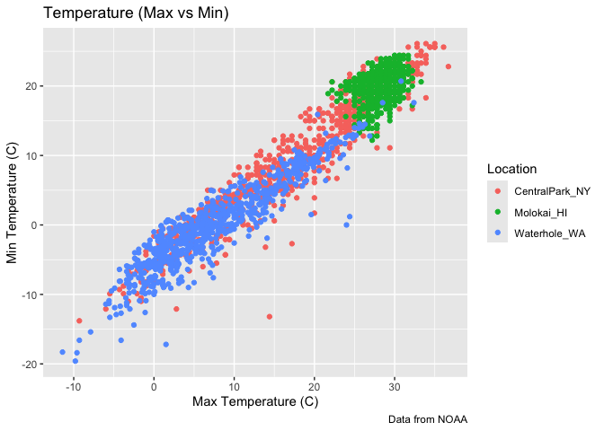
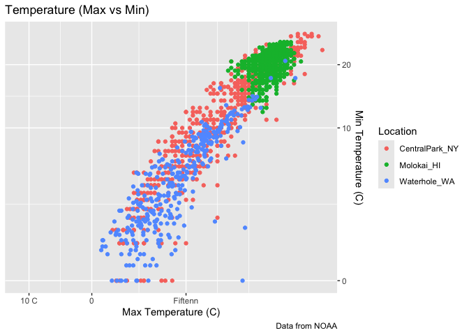
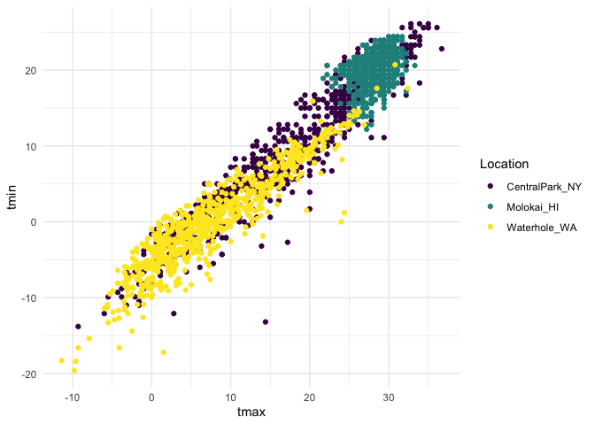
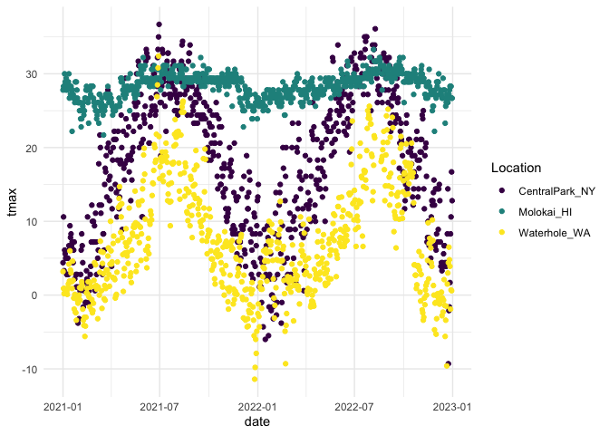
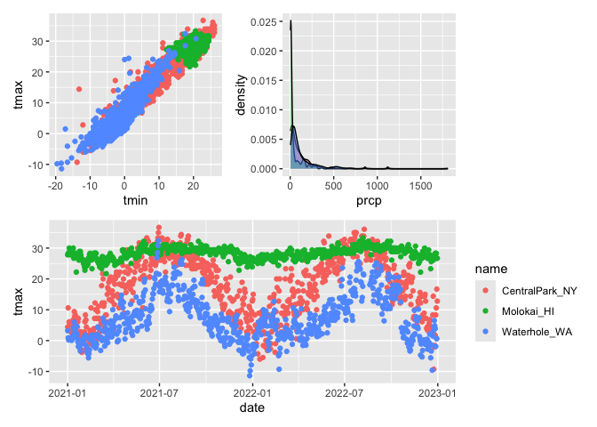
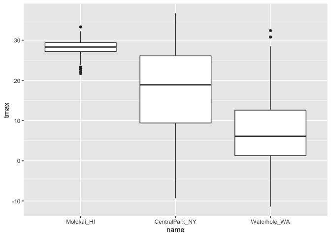

Visualization
================

``` r
library(tidyverse)
```

    ## ── Attaching core tidyverse packages ──────────────────────── tidyverse 2.0.0 ──
    ## ✔ dplyr     1.2.1     ✔ readr     2.2.0
    ## ✔ forcats   1.0.1     ✔ stringr   1.6.0
    ## ✔ ggplot2   4.0.3     ✔ tibble    3.3.1
    ## ✔ lubridate 1.9.5     ✔ tidyr     1.3.2
    ## ✔ purrr     1.2.2     
    ## ── Conflicts ────────────────────────────────────────── tidyverse_conflicts() ──
    ## ✖ dplyr::filter() masks stats::filter()
    ## ✖ dplyr::lag()    masks stats::lag()
    ## ℹ Use the conflicted package (<http://conflicted.r-lib.org/>) to force all conflicts to become errors

``` r
library(patchwork)
library(p8105.datasets)

data("weather_df")
```

Now we have everything we need!

Start with a scatterplot.

``` r
weather_df |> 
  ggplot(aes(x = tmax, y = tmin, color = name)) + 
  geom_point() + 
  labs(
    title = "Temperature (Max vs Min)",
    x = "Max Temperature (C)",
    y = "Min Temperature (C)",
    color = "Location",
    caption = "Data from NOAA"
  )
```

    ## Warning: Removed 17 rows containing missing values or values outside the scale range
    ## (`geom_point()`).

<!-- -->

Let’s try some other scales.

``` r
weather_df |> 
  ggplot(aes(x = tmax, y = tmin, color = name)) + 
  geom_point() + 
  labs(
    title = "Temperature (Max vs Min)",
    x = "Max Temperature (C)",
    y = "Min Temperature (C)",
    color = "Location",
    caption = "Data from NOAA"
  ) + 
  scale_x_continuous(
    breaks = c(-10, 0, 15),
    labels = c("10 C", "0", "Fiftenn")
  ) + 
  scale_y_continuous(
    trans = "sqrt",
    position = "right"
  )
```

    ## Warning in transformation$transform(x): NaNs produced

    ## Warning in scale_y_continuous(trans = "sqrt", position = "right"): sqrt
    ## transformation introduced infinite values.

    ## Warning: Removed 520 rows containing missing values or values outside the scale range
    ## (`geom_point()`).

<!-- -->

``` r
weather_df |> 
  ggplot(aes(x = tmax, y = tmin, color = name)) + 
  geom_point() + 
  viridis::scale_color_viridis(
    name = "Location",
    discrete = TRUE
  )
```

    ## Warning: Removed 17 rows containing missing values or values outside the scale range
    ## (`geom_point()`).

<!-- -->

## Themes

``` r
weather_df |> 
  ggplot(aes(x = tmax, y = tmin, color = name)) + 
  geom_point() + 
  viridis::scale_color_viridis(
    name = "Location",
    discrete = TRUE
  ) + 
  theme(
    legend.position = "bottom"
  ) + 
  theme_minimal()
```

    ## Warning: Removed 17 rows containing missing values or values outside the scale range
    ## (`geom_point()`).

<!-- -->

``` r
weather_df |> 
  ggplot(aes(x = date, y = tmax, color = name)) + 
  geom_point() + 
  viridis::scale_color_viridis(
    name = "Location",
    discrete = TRUE
  ) + 
  theme(
    legend.position = "bottom"
  ) + 
  theme_minimal()
```

    ## Warning: Removed 17 rows containing missing values or values outside the scale range
    ## (`geom_point()`).

<!-- -->

## Two more weird but useful plot things

``` r
central_park_df = 
  weather_df |> 
  filter(name == "CentralPark_NY")

molakai_df = 
  weather_df |> 
  filter(name == "Molokai_HI")

ggplot() + 
  geom_point(molakai_df, mapping = aes(x = date, y = tmax, color = name)) + 
  geom_line(central_park_df, mapping = aes(x = date, y = tmax, color = name))
```

    ## Warning: Removed 1 row containing missing values or values outside the scale range
    ## (`geom_point()`).

<!-- -->

``` r
ggp_tmax_tmin = 
  weather_df |> 
  ggplot() + 
  geom_point(mapping = aes(x = tmin, y = tmax, color = name)) + 
  theme(legend.position = "none")

ggp_prcp_density = 
  weather_df |> 
  filter(prcp > 0) |>
  ggplot(mapping = aes(x = prcp, fill = name)) + 
  geom_density(alpha = 0.5) + 
  theme(legend.position = "none")

ggp_seasonal = 
  weather_df |> 
  ggplot(mapping = aes(x = date, y = tmax, color = name)) + 
  geom_point()

(ggp_tmax_tmin + ggp_prcp_density) / ggp_seasonal
```

    ## Warning: Removed 17 rows containing missing values or values outside the scale range
    ## (`geom_point()`).
    ## Removed 17 rows containing missing values or values outside the scale range
    ## (`geom_point()`).

<!-- -->

## Data manipulation

Start with factors.

``` r
weather_df |> 
  mutate(name = fct_relevel(name, c("Molokai_HI", "CentralPark_NY", "Waterhole_WA"))) |>
  ggplot(mapping = aes(x = name, y = tmax)) + 
  geom_boxplot()
```

    ## Warning: Removed 17 rows containing non-finite outside the scale range
    ## (`stat_boxplot()`).

<!-- -->

Make the distribution plots

``` r
weather_df |> 
  select(name, tmax, tmin) |> 
  pivot_longer(
    tmax:tmin, 
    names_to = "observation",
    values_to = "temp"
  ) |> 
  ggplot() + 
  geom_density(mapping = aes(x = temp, fill = observation), alpha = 0.5) + 
  facet_grid(. ~ name)
```

    ## Warning: Removed 34 rows containing non-finite outside the scale range
    ## (`stat_density()`).

<!-- -->
